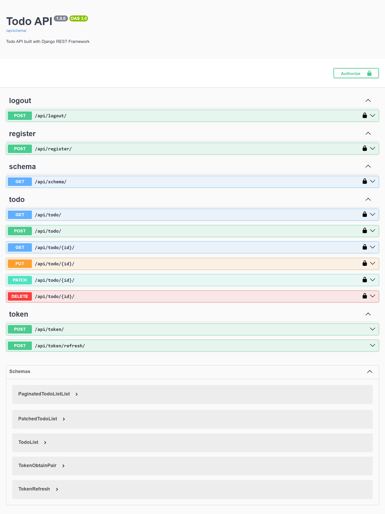

# Todo API



A Todo API built with Django and Django REST Framework.

## Features

- User registration
- JWT authentication with access and refresh tokens
- Logout with refresh token blacklisting
- Todo CRUD operations
- Search by title and description
- Filter by completion status
- Ordering by creation date and title
- Pagination support via DRF default pagination
- Swagger API documentation
- Owner-only access for regular users
- Admin users can view all todos

## Technology Stack

- Python
- Django
- Django REST Framework
- djangorestframework-simplejwt
- django-filter
- drf-spectacular

## Installation

```bash
git clone <repository-url> todo-api
cd todo-api
python -m venv venv
```

Activate the virtual environment:

```bash
# Windows PowerShell
venv\Scripts\Activate.ps1
```

Install dependencies:

```bash
pip install -r requirements.txt
```

Run migrations:

```bash
python manage.py migrate
```

Create a superuser:

```bash
python manage.py createsuperuser
```

Start the development server:

```bash
python manage.py runserver
```

## API Documentation

Swagger UI is available at:

```text
http://127.0.0.1:8000/api/docs/
```

## Authentication Endpoints

- `POST /api/register/` - register a new user
- `POST /api/token/` - obtain JWT access and refresh tokens
- `POST /api/token/refresh/` - refresh access token
- `POST /api/logout/` - blacklist refresh token and logout

## Todo Endpoints

The Todo endpoints are registered under `/api/todo/`.

- `GET /api/todo/` - list todos for the authenticated user
- `POST /api/todo/` - create a new todo
- `GET /api/todo/{id}/` - retrieve a specific todo
- `PUT /api/todo/{id}/` - update a todo
- `PATCH /api/todo/{id}/` - partially update a todo
- `DELETE /api/todo/{id}/` - delete a todo

## Query Parameters

Todo listing supports:

- `search` — search by `title` or `description`
- `is_completed` — filter by completion status
- `ordering` — order by `create_at` or `title`

Example:

```text
GET /api/todo/?search=groceries&is_completed=false&ordering=-create_at
```

## Notes

- Todo items are owned by the authenticated user.
- Admin/staff users can access all todo items.
- `user` field is set automatically and is read-only in the todo serializer.

## Requirements

- Django 6.0.5
- djangorestframework 3.17.1
- djangorestframework-simplejwt 5.5.1
- django-filter 25.2
- drf-spectacular 0.29.0

## Author

Ezatullah Rasa
